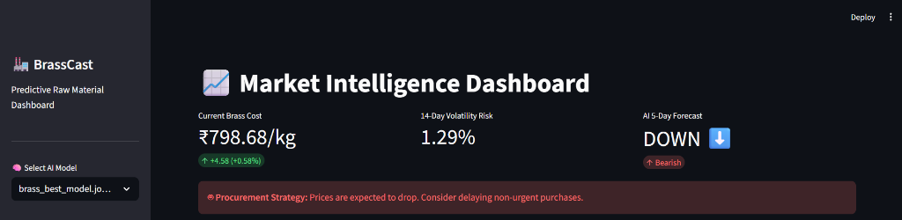
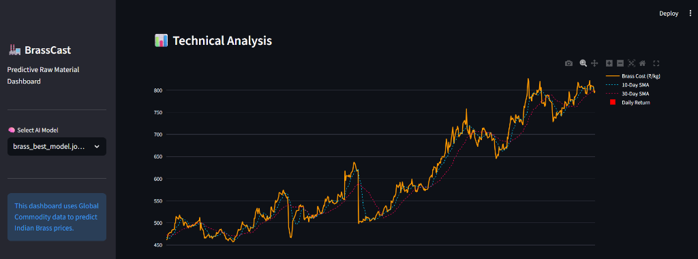

# 🏭 BrassCast - Predictive Raw Material Dashboard




An end-to-end Machine Learning pipeline and interactive dashboard designed to predict raw material (Brass) cost volatility using global commodity prices. This tool was built to help MSME foundries in clusters like Jamnagar optimize their procurement strategies against currency depreciation and global metal swings.

## 🚀 Key Features

*   **Data Engineering:** Automated fetching of 15+ years of global market data (COMEX Copper, Hindustan Zinc, USD/INR, WTI Crude Oil) using Yahoo Finance, merged and chronologically aligned.
*   **Domain-Specific Feature Engineering:** Computes a custom **Synthetic Brass Scrap Index**, applying real-world impurity discounts, alongside Technical Indicators (SMA 10/30, 14-day Volatility, Daily Returns).
*   **Advanced Machine Learning:** Pits Baseline Random Forest against XGBoost and an Ensemble (Voting Classifier). Hyperparameters were aggressively tuned using **Optuna** to find the mathematical global maximum.
*   **No Lookahead Bias:** Custom training loops utilizing strict chronological train/test splitting to prevent time-series data leakage.
*   **Interactive UI:** Deployed a responsive, dark-mode Streamlit dashboard with real-time Plotly Financial charts, dynamic KPIs, and actionable "Bullish/Bearish" procurement alerts.

## 💻 Tech Stack
*   **Python:** Pandas, NumPy, Scikit-Learn
*   **Machine Learning:** XGBoost, Optuna (Hyperparameter Tuning), Joblib
*   **Frontend & Viz:** Streamlit, Plotly Graph Objects

## ⚙️ How to Run Locally

1. Clone the repository:
   ```bash
   git clone https://github.com/NakumHardik/BrassCast-.git
   cd BrassCast-
   ```
2. Install the required libraries:
   ```bash
   pip install -r requirements.txt
   ```
3. Run the dashboard:
   ```bash
   streamlit run app/app.py
   ```
